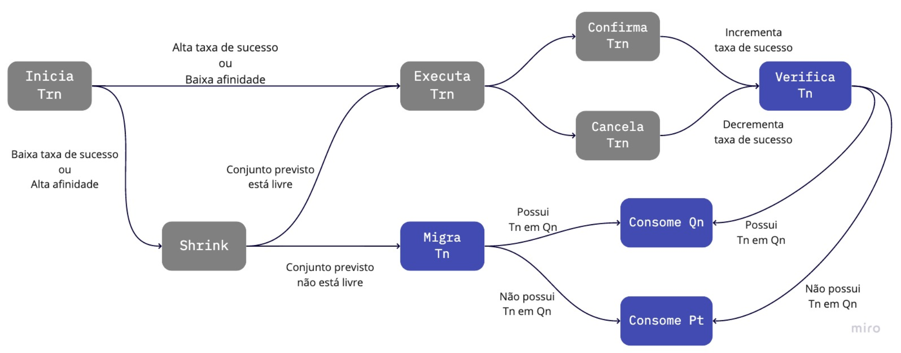

# Seminário de Andamento para o Mestrado em Computação

## Escalonador de Transações para arquitetura NUMA

- Michael Alexandre Costa
- UFPel 2020-1

### Resumo

Propomos um escalonador de transações que tenha conhecimento sobre a arquitetura na qual está executando.

O objetivo é adequar a execução das threads com base no comportamento de suas transações e nos conjuntos de leitura e escrita, sempre observando o custo de acesso aos bancos de memória quando utilizada arquitetura NUMA.

### Ferramentas

Estudamos e vamos utilizar a biblioteca de STM TinySTM, o conjunto de benchmark STAMP, e a biblioteca Hwloc.

Também estudamos utilizar como base o escalonar de STM Shrink.

### Modificações

Propomos um novo fluxo de execução para as threads em execução com base no escalonador Shrink.

Abaixo temos o fluxo de execução de uma thread ao iniciar a execução de uma transação.

